# 🎓 PL/SQL Oracle Database Capstone Project ⚡
  🛒 Powered by PL/SQL | 🔄 Automated Alerts | 📊 BI-Ready

--- 

## 👤 Identification
- **Name:** Irakoze Nshuti Fabrice  
- **Student ID:** 28264  
- **Project Title:** Real-Time Inventory Reorder Alert System 
- **Course:** INSY 8311 - Database Development with PL/SQL  
- **Academic Year:** 2025-2026
- **Institution:**Z Adventist University of Central Africa (AUCA)
- **Lecturer:** Eric Maniraguha (eric.maniraguha@auca.ac.rw)  

---

### 📌 Objective
To identify a real-world problem that requires a **PL/SQL-based Oracle database solution** For Inventory Optimization and Sales Data Integrity with BI potential.

---

## 🚀 Phase I: Problem Statement & Presentation

## 💡 Project Definition: Small Retail Inventory System

### 📖 Problem Definition ❗
Small retail stores often struggle with manual inventory tracking. This leads to:
- 📉 Inventory Instability: Overstocking or stockouts
- 🕒 Inefficiency in restocking: Real Time Alerts.
- 🧮 Flawed Input Data: Inaccurate sales reporting

### 🌍 Context
The system targets a multi-branch retail business:
✔ 🛒 Supermarkets.
✔ 💻 Electronic shops.
✔ 👚 Clothing stores.
✔ 🔧 Hardware stores.


### 🎯 Target Users 👥
- 💼 Inventory Managers
- 📊 Data Analysts/BI Team
- 🛒 Purchasing Agents

### 🏆 Project Goals
- 🚨 Automated Alerting  
- 🔍 Data Validation 
- 🔔 Process Improvement 
- 📦 Auditing Foundation   

---

## 🚀 Phase II: Business Process Modeling

## 🧩  Identify Key Database Entities:

| Entity              | explanations                                                                        |
|---------------------|-------------------------------------------------------------------------------------|
| **PRODUCTS**        | The items being managed.                                                            |
| **WAREHOUSES**      | Locations where inventory is stored                                                 |
| **INVENTORY**       | The transactional table tracking stock quantity at each warehouse for each product. |
| **SUPPLIERS**       | Who provides the products.                                                          |
| **TRANSACTIONS**    | Tracks all incoming and outgoing movements of inventory.                            |
| **HOLIDAYS**        | A utility table for the Advanced Auditing requirement.                              |
| **AUDIT_LOG**       | To record restricted transaction attempts.                                          |

hhhhhhhhhhhhhhhhhhhhhhhhhhhhhhhhhhhhhhhhhhhhh(diagrams UML/BPMN)

## 📝Explanation
🛡️**Organizational Impact:**
**Mitigation of Stockouts/Overstocking:** By using real-time triggers instead of manual checks, the time-to-alert is reduced to seconds. This allows for proactive replenishment, minimizing stockouts (lost revenue) and reducing the need for expensive emergency orders or overstocking (high holding costs).
**Improved Decision Confidence:** Ensuring that the sales data used to drive the inventory calculation is validated and audited guarantees that the reorder alerts are based on correct information.
 🗂️**MIS Functions Modeled:**
**Transactional Control:** The PL/SQL validation trigger acts as a critical control function, preventing bad data from corrupting the database.
**Automation:** The system automates the stock status analysis (Step 4), which traditionally required manual reporting, thereby improving restocking efficiency.
 ✨**Analytics Opportunities:**
The model creates data points for BI in the Audit Log (tracking sources of inaccurate sales data) and the REORDER_ALERT table (analyzing trends in replenishment needs and efficiency).

## 📐 Phase III: Logical Model Design

### 🗃️ Entities & Attributes

#### 📦 PRODUCTS

| Attribute    | Type         | Constra                | Description                           |
|--------------|--------------|------------------------|---------------------------------------|
| PRODUCT_ID   | VARCHAR2(20) | PK, NOT NULL           | Unique product SKU.                   |
| PRODUCT_NAME | VARCHAR2(100)| NOT NULL               | Name of the product.                  |
| REORDER_POINT| NUMBER(10)   | NOT NULL, CHECK(>0)    | Minimum stock level to trigger alert. |
| UNIT_PRICE   | NUMBER(8,2)  | NOT NULL, CHECK(>0)    | Unit selling price.                   |

#### 📦 WAREHOUSES

| Attribute    | Type         | Constra                | Description                  |
|--------------|--------------|------------------------|------------------------------|
| WAREHOUSE_ID | NUMBER(5)    | PK, NOT NULL           | Unique warehouse identifier. |      
| WH_LOCATION  | VARCHAR2(50) | NOT NULL               | City or region.              |


#### 🧾 INVENTORY

| Attribute        | Type         | Constraint           | Description                  |
|------------------|--------------|----------------------|------------------------------|
| PRODUCT_ID       | VARCHAR2(20) | PK, FK (PRODUCTS)    | Product identifier.          |
| WAREHOUSE_ID     | NUMBER(5)    | PK, FK (WAREHOUSES)  | Warehouse identifier.        |
| STOCK_QUANTITY   | NUMBER(10)   | NOT NULL, CHECK(>=0) | Current stock on hand.       |
| LAST_UPDATE_DATE | DATE         | NOT NULL             | When stock was last updated. |

#### 🚚 TRANSACTIONS

| Attribute        | Type         | Constraint                         |  Description                    |
|------------------|--------------|------------------------------------|---------------------------------|
| TRANSACTION_ID   | NUMBER       | PK                                 | Unique ID (SEQUENCE generated). |
| PRODUCT_ID       | VARCHAR2(20) | FK (PRODUCTS)                      | Item involved.                  |
| WAREHOUSE_ID     | NUMBER(5)    | FK (WAREHOUSES)                    | Location of transaction.        |
| TRANSACTION_TYPE | VARCHAR2(10) | NOT NULL, CHECK ('SALE','RECEIPT') | Type of movement.               |
| QUANTITY_CHANGE  | NUMBER(10)   | NOT NULL, CHECK(>0)                | Quantity moved.                 |
| TRANSACTION_DATE | DATE         | NOT NULL                           | Timestamp of the event.         |

#### 🖥️ HOLIDAYS

| Attribute     | Type         | Constraint                       |  Description                  |
|---------------|--------------|----------------------------------|------------------------------|
| HOLIDAY_DATE   | DATE       | PK  | Public holidays used for restriction rule.

#### 🔗 AUDIT_LOG

| Attribute    | Type         | Constraint | Description                       |
|--------------|--------------|------------|-----------------------------------|
| AUDIT_ID     | NUMBER       | PK         | Unique ID (SEQUENCE generated).   |
| USER_ID      | VARCHAR2(50) | NOT NULL   | User attempting DML.              |
| DML_TYPE     | VARCHAR2(10) | NOT NUL    | Operation (INSERT/UPDATE/DELETE). |
| TABLE_NAME   | VARCHAR2(50) | NOT NULL   | Table target.                     |
| ATTEMPT_TIME | DATE         | NOT NULL   | When the attempt was made.        |
| STATUS       | VARCHAR2(10) | NOT NULL   | Allowed/Denied.                   |

---

## 🔑 Key Assumptions (Phase III: Logical Design)
**Data & Scope**
**User Identification:** It is assumed that the Oracle environment can provide a current user ID (SYS_CONTEXT) for all DML operations, allowing the AUDIT_LOG table to accurately track which user performed which action.
**Master Data Stability:** Dimension tables (SUPPLIER, CATEGORY, etc.) are considered stable. The project primarily focuses on transactional data (SALES_TRANSACTION, INVENTORY_ITEM stock) and the derived data (REORDER_ALERT).
**Data Validation Rules:** All specific sales data validation rules (e.g., minimum price check, acceptable transaction hours) are predefined and hard-coded into the PL/SQL validation functions and triggers.
**Inventory & Restocking Logic**
**Demand Calculation:** The reorder quantity calculation relies on a simple, aggregated metric, specifically the average daily sales over the last 30 days for the relevant item. Complex predictive models (e.g., exponential smoothing, machine learning) are outside the scope.
**Lead Time:** The supplier lead time (in days) is treated as a static, fixed value stored in the SUPPLIER table and is used directly in the reorder calculation.
**Safety Stock:** A fixed safety stock level is defined per item within the INVENTORY_ITEM table.
**Security & Auditing**
**System Integrity:** The restriction trigger (Phase VII) for security and compliance rules will be implemented based on simple logic, such as blocking DML operations during defined non-business hours or weekends, rather than complex role-based access control (which is handled by Oracle grants).

## 🏗️ Phase IV: Database Creation

### 🎯 Objective

To create a dedicated Oracle PL/SQL database environment using SQL Developer as an **alternative to Oracle Enterprise Manager (OEM)**. This setup provides full access control and prepares the development environment for Phase V.

---

### 🔐 Task 1: PDB and User Creation (SQL Developer)

The user and development environment were set up inside an Oracle **Pluggable Database (PDB)** using **SQL Developer**, which allows graphical interaction and full administrative capabilities.

---

### 🧰 Configuration Summary

| Component              | Value                               |
|------------------------|-------------------------------------|
| **Tool Used**          | SQL Developer                       |
| **PDB Name**           | `wed_28264_irakoze_realtimeIRAS_db` |
| **User Created**       | `irakoze_28264`                     |
| **Password**           | `INFab@28264!`                      |
| **Privileges Granted** | Full DBA privileges                 |

---

### 📸 Screenshot: PDB Creation in SQL Developer

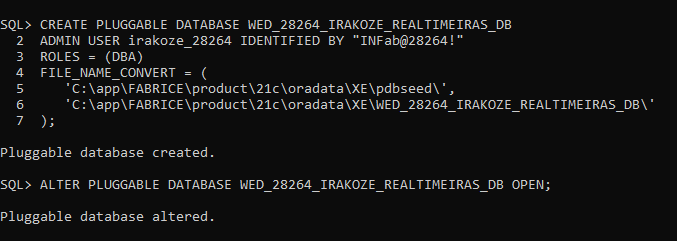

```sql
-- SQL run inside SQL plus

CREATE PLUGGABLE DATABASE WED_28264_IRAKOZE_REALTIMEIRAS_DB
ADMIN USER irakoze_28264 IDENTIFIED BY "INFab@28264!"
ROLES = (DBA)
FILE NAME_CONVERT = (
    'C:\app\FABRICE\product\21c\oradata\XE\pdbseed',
    'C:\app\FABRICE\product\21c\oradata\XE\WED_28264_IRAKOZE_REALTIMEIRAS_DB'
);

```
---

## 🧱 Phase V: Table Implementation and Data Insertion

### 🎯 Objective

To implement the physical database structure based on the logical model and insert meaningful, testable data. This phase ensures structural integrity, accurate constraints, and realistic data to support business operations and future PL/SQL programming.

---

### 🔨 Step 1: Table Creation

✅ The following tables were created in the schema `WED_28264_IRAKOZE_REALTIMEIRAS_DB` using SQL Developer:

---

#### 🧱 Table: PRODUCTS

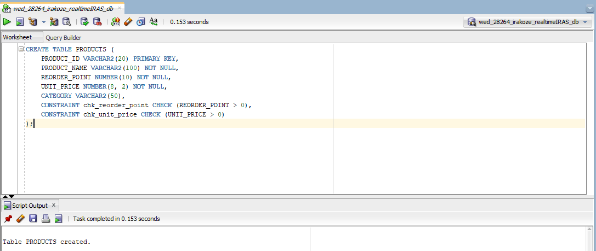

---

#### 🧱 Table: WAREHOUSES

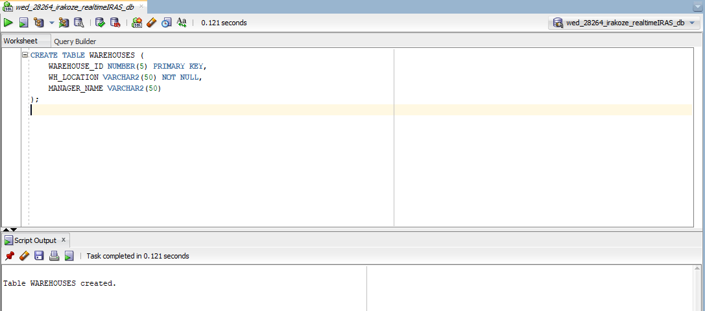

---

#### 🧱 Table: INVENTORY

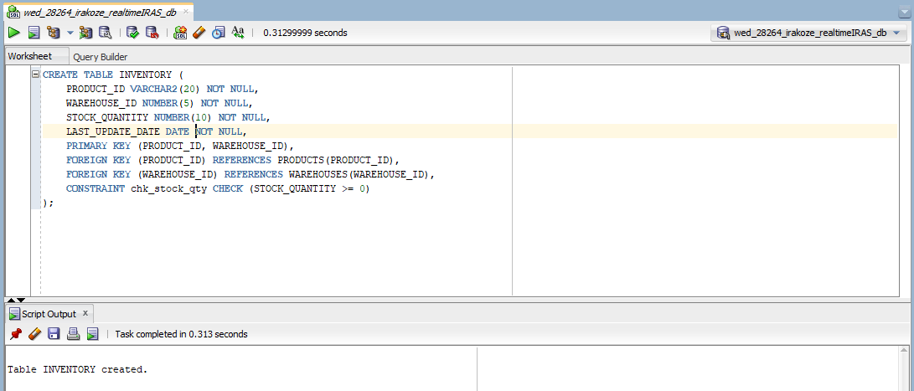

---

#### 🧱 Table: TRANSACTIONS

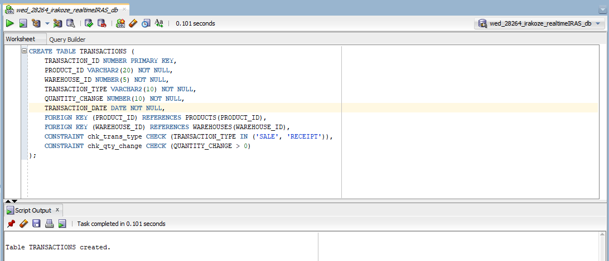

---

#### 🧱 Table: HOLIDAYS

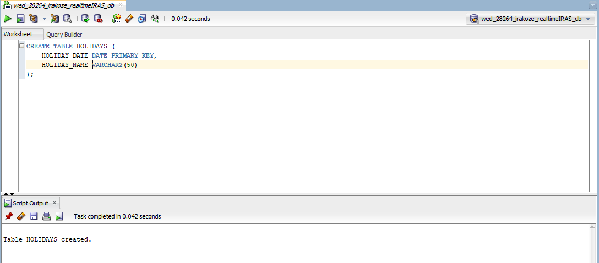

---

#### 🧱 Table: AUDIT_LOG Table

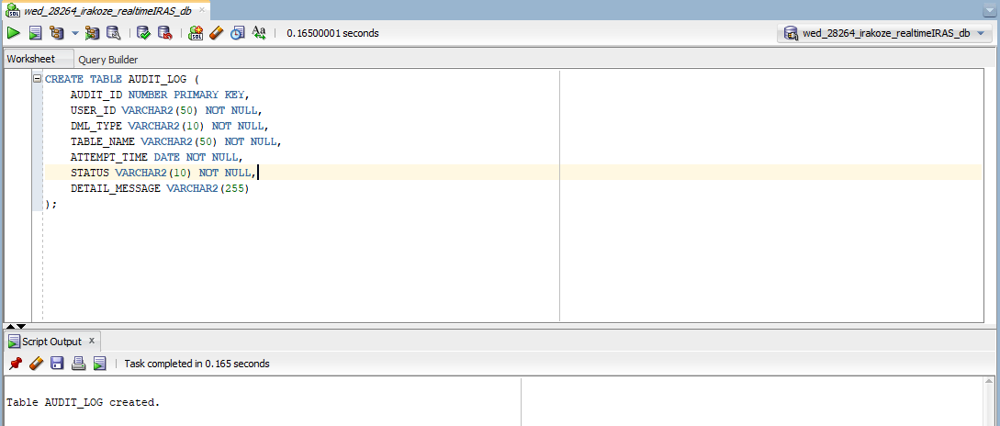

---

### 📥 Step 2: Data Insertion

#### 🗃️ Insertion:

Dynamic Data Generation (Ensuring 100-500+ rows) using PL/SQL Procedure
TARGETS: 10 WAREHOUSES, 50 PRODUCTS, 500 INVENTORY, 1000 TRANSACTIONS

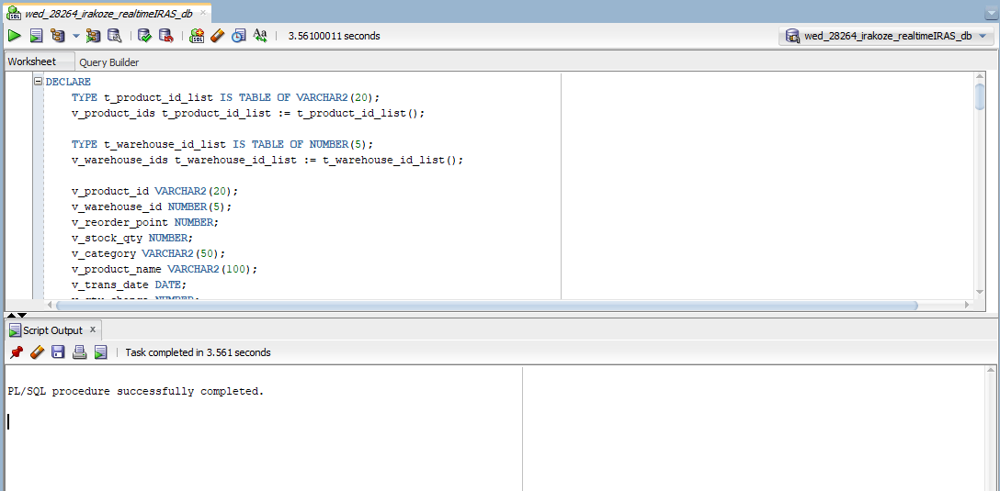

---

### 📥 Step 3: Simple Validation Queries

Verifying the 100-500+ row requirement

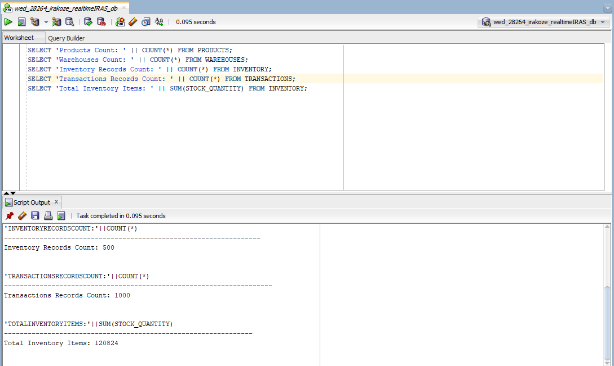

Showing a sample of 10 alerts

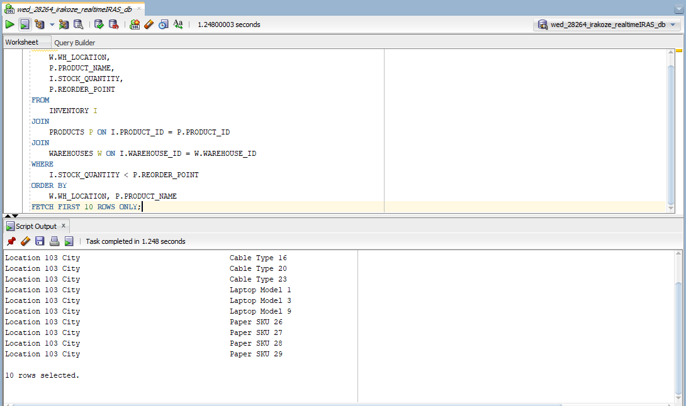

### 📥 Step 4: Index Creation for Performance

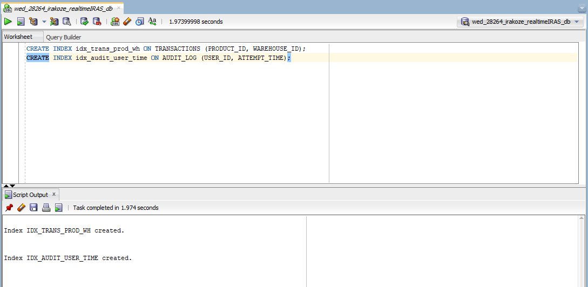

## 🔧 Phase VI: Database Interaction & Transactions

### 🎯 Objective

Develop PL/SQL procedures, functions, and packages.
Contains Procedures and Functions for Inventory Management.

---

## 🛠️ PL/SQL Components

### ✅ Procedure: `Package_specification`

- check if stock is below the reorder point.
- Records a transaction.
- calculate the Stock Cover Days (BI/Analytical function).
- report all current reorder alerts.

---

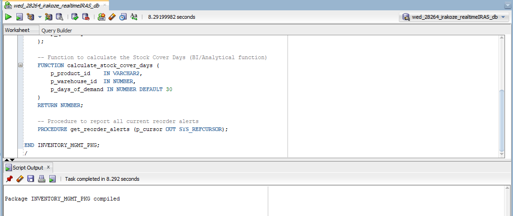

---

### ✅ Procedure: `Package_body and DML Procedure`

- checks reorder status.
- record transaction and update stock.
- Analytical Function to Calculate Stock Cover Days.
- reports all current reorder alerts (using Explicit Cursor logic)

---

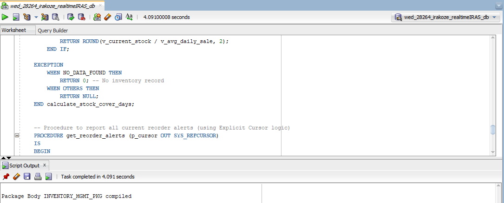

---

## 🧪 Example Execution and Testing:

---

### ✅ Test 1: Record a new sale

should update stock and trigger alert message

---

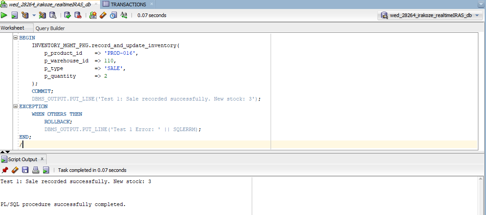

### ✅ Test 2: Record a receipt

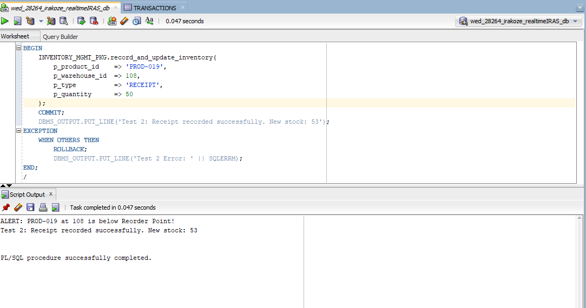

### ✅ Test 3: Run the Reorder Alert Report

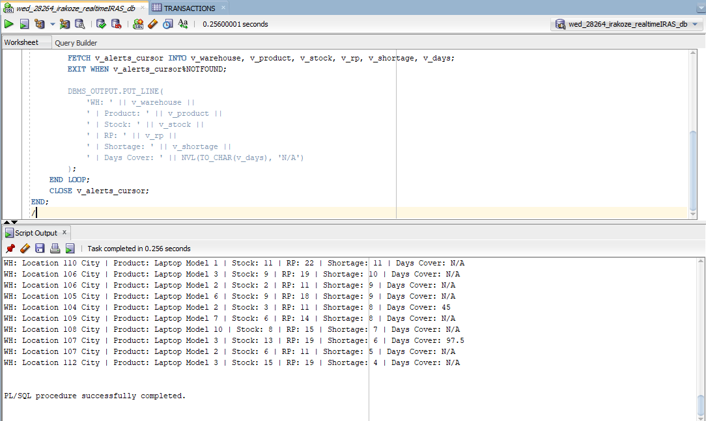

---

## 🧠 Phase VII: Advanced Programming & Auditing

### 🎯 Objective

Implement triggers, business rules, and comprehensive auditing.

- ❌ Preventing table changes during weekdays and holidays
- 🕵️ Tracking who tried to change what and when
- 📦 Centralizing audit logic via PL/SQL packages

This adds a layer of **governance**, **traceability**, and **control**, critical for Management Information Systems.

---

## 🕵️ Auditing System

### ✅ Function: `Log Audit Attempt` and ` Restriction Check`

Employees CANNOT INSERT/UPDATE/DELETE on WEEKDAYS or PUBLIC HOLIDAYS

---

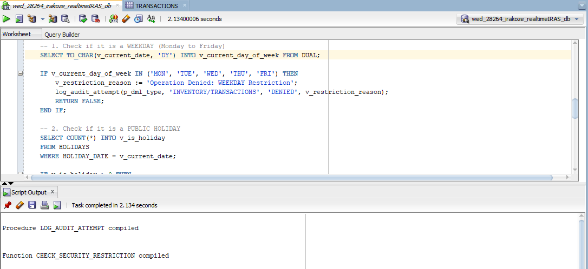

---

## 🧨 Trigger

Compound Trigger on TRANSACTIONS and INVENTORY
Here we are going to apply the checking.

---

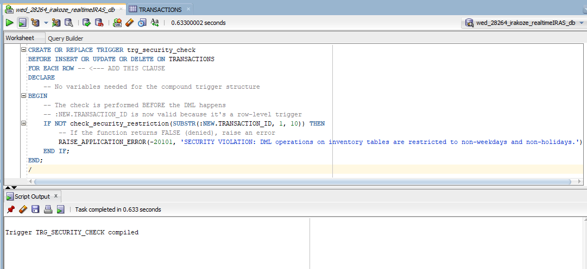

---

Here we are going to apply the security.
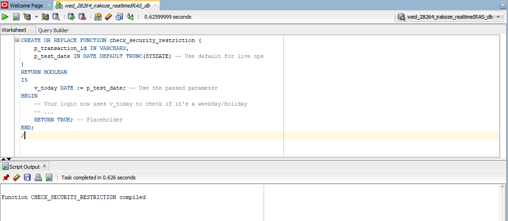


---
> 📁 ['click here to view all sql codes'](./WED_28264_IRAKOZE_REALTIMEIRAS_db.sql) 


